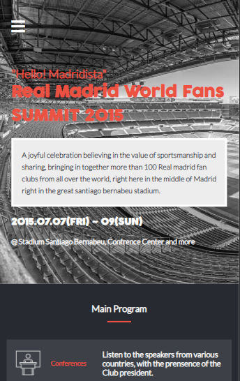
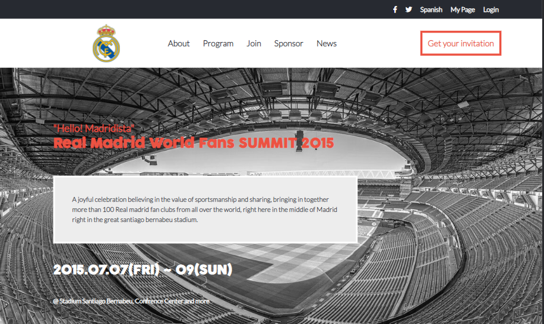

# Project Name

<h1 align="center"> Module One Capstone Project -RM Fans Summit-</h1>

# Screenshots

Desktop view

 Mobile view

 

## Built With

- HTML
- CSS
- Javascript

## Live Demo (if available)

## Getting Started
- To clone this repositry on your Local desktop
Feel free to get it through HTTPS protocol or through SSH
- To Install it . Open you Git Bash , paste the url right after typing the git clone command
To get a local copy up and running follow these simple example steps.

## Authors

👤 **Author**
- GitHub: [@NabilHY](https://github.com/NabilHY)
- Twitter: [@NeoNabil2](https://twitter.com/NeoNabil2)

## 🤝 Contributing

Contributions, issues, and feature requests are welcome!
Feel free to check the [issues page](../../issues/).

## Show your support

Give a ⭐️ if you like this project!

## Acknowledgments

- The design has been inspired by Cindy Shin design on Behance.
- A special thanks to everyone who helped me during the past weeks within the microverse community, for showing your love and support.
- etc

## 📝 License

This project is [MIT](./MIT.md) licensed.
